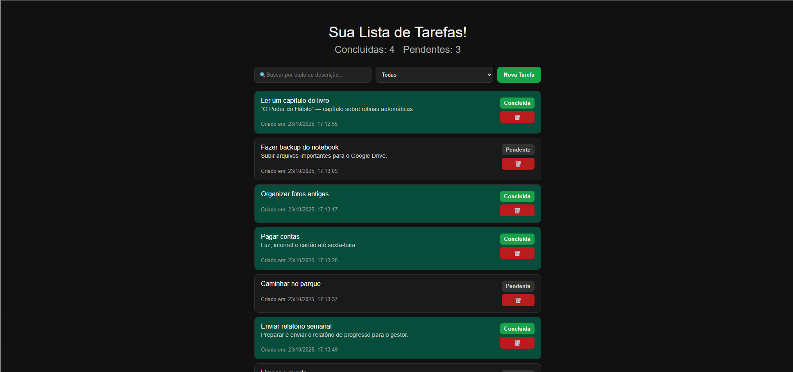
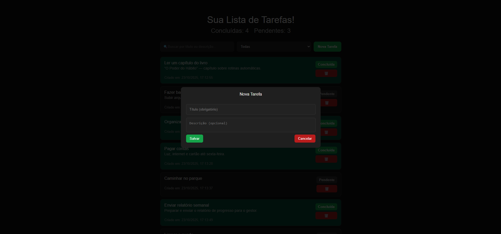
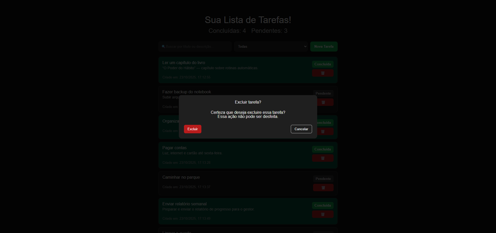
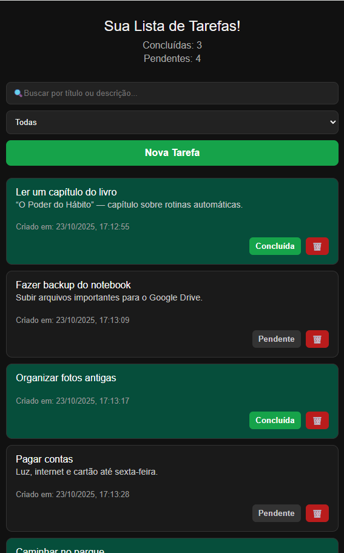

# 🚀 Teste Prático - Desenvolvedor React  

Este projeto é um **sistema de gerenciamento de tarefas** desenvolvido em **React** com **Vite**, que permite adicionar, listar, filtrar e excluir tarefas com persistência local.  

---

## 🧩 Como executar o projeto  

1. **Clone o repositório:**  
   ```bash
   git clone https://github.com/Fernand0cruz/task-flow.git
   ```

2. **Acesse o diretório do projeto:**  
   ```bash
   cd task-flow
   ```

3. **Instale as dependências:**  
   ```bash
   npm install
   ```

4. **Execute o projeto:**  
   ```bash
   npm run dev
   ```

5. **Acesse no navegador:**  
   ```
   http://localhost:5173
   ```

---

## 📝 Descrição  

Aplicação para **gerenciamento de tarefas**, onde é possível cadastrar, listar, filtrar, marcar como concluídas e excluir tarefas.  
As tarefas são salvas no **localStorage**, garantindo que permaneçam após recarregar a página.  

---

## ⚙️ Funcionalidades Implementadas  

### 1. **Listagem de Tarefas**
- Exibe todas as tarefas cadastradas.  
- Mostra título, descrição, status (pendente/concluída) e data de criação.  
- Indica visualmente as tarefas concluídas (riscadas ou com cor diferente).  

### 2. **Adicionar Tarefa**
- Formulário com campos: **título (obrigatório)** e **descrição (opcional)**.  
- Validação do campo título.  
- Adiciona nova tarefa à lista e limpa o formulário automaticamente.  

### 3. **Gerenciar Status**
- Botão para marcar ou desmarcar como concluída.  
- Atualiza visual da tarefa conforme o status.  
- Contadores de tarefas **pendentes** e **concluídas** no cabeçalho.  

### 4. **Filtros e Busca**
- Filtro por status: **Todas**, **Pendentes** e **Concluídas**.  
- Campo de busca por título ou descrição.  
- Atualização em tempo real dos resultados conforme o usuário digita.  

### 5. **Exclusão de Tarefas**
- Botão de exclusão em cada tarefa.  
- Modal de confirmação antes de excluir.  
- Atualiza os contadores após a exclusão.  

### 6. **Persistência Local**
- Armazena as tarefas no **localStorage**.  
- Carrega automaticamente as tarefas ao iniciar a aplicação.  
- Mantém os dados entre sessões.  

---

## 🧰 Tecnologias Utilizadas  

- ⚡ **Vite** — ambiente de desenvolvimento rápido  
- ⚛️ **React** — biblioteca para construção de interfaces  
- 💾 **localStorage** — persistência local de dados  

---

## 🖼️ Imagens da Interface  

### Interface principal  



### Modal de nova tarefa  



### Modal de confirmação de exclusão  



### Responsividade

  

---

### ✨ Desenvolvido por [Fernando Cruz](https://github.com/Fernand0cruz)
